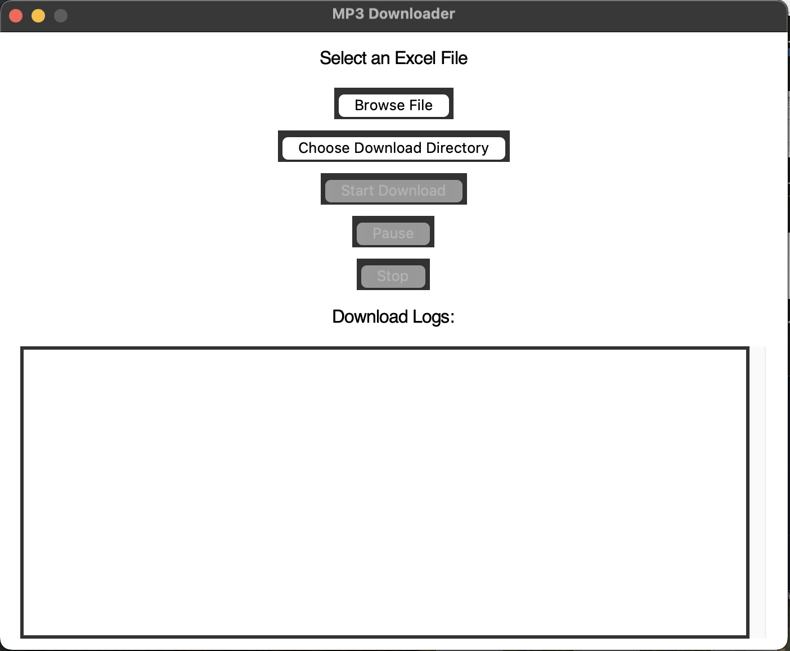

# MP3 Downloader

The **MP3 Downloader** is a Python-based desktop application that allows users to download MP3 files from URLs provided in an Excel file. It features a graphical user interface (GUI) built with `Tkinter` and supports pausing, resuming, and stopping downloads. The application also logs download progress and maintains a record of completed downloads.

---

## Features

- **Excel File Input**: Select an Excel file containing MP3 URLs and additional data.
- **Custom Download Directory**: Choose a directory where downloaded MP3 files will be saved.
- **Pause and Resume**: Pause downloads at any point and resume them later.
- **Stop Downloads**: Cancel ongoing downloads at any time.
- **Download Logs**: View real-time logs of the download process in the app.
- **Error Handling**: Handles invalid URLs, failed downloads, and empty fields gracefully.
- **CSV Download Log**: Saves a record of completed downloads in `download_log.csv`.

---

## Prerequisites

To run this application, you need the following installed on your system:

1. **Python 3.7 or higher**
2. **Required Python libraries**:
   - `tkinter` (comes pre-installed with Python)
   - `pandas`
   - `requests`

---

## Installation

1. **Clone or download this repository**:
   ```bash
   git clone https://github.com/majidfeiz/mp3-downloader.git
   cd mp3-downloader
   ```

2. **Set up a virtual environment (optional but recommended)**:
   ```bash
   python3 -m venv venv
   source venv/bin/activate   # On Windows: venv\Scripts\activate
   ```

3. **Install the required dependencies**:
   ```bash
   pip install -r requirements.txt
   ```

---

## How to Use

1. **Run the application**:
   ```bash
   python3 mp3_downloader.py
   ```

2. **Select an Excel file**:
   - Click the **"Browse File"** button to select an Excel file.
   - Ensure the Excel file contains a column named `فایل` for MP3 URLs and `کد ملی` for additional metadata.

3. **Choose a download directory**:
   - Click the **"Choose Download Directory"** button to select a folder for saving downloaded files.

4. **Start the download process**:
   - Click the **"Start Download"** button to begin downloading MP3 files.

5. **Pause and resume downloads**:
   - Use the **"Pause"** button to pause downloads.
   - Click the **"Resume"** button to continue.

6. **Stop downloads**:
   - Use the **"Stop"** button to cancel the download process.

7. **View logs**:
   - Monitor the download progress in the **Download Logs** section.

---

## Excel File Format

Your Excel file should contain the following columns:

- **`فایل`**: The URLs of the MP3 files to download.
- **`کد ملی`**: Additional metadata (e.g., user ID or identifier).

Example:

| فایل                                | کد ملی     |
|-------------------------------------|------------|
| https://example.com/audio1.mp3      | 1234567890 |
| https://example.com/audio2.mp3      | 9876543210 |

---

## Download Logs

- The application creates a log file named `download_log.csv` in the root directory.
- This log file contains details of each download, including:
  - Row ID
  - MP3 URL
  - Download status (Success or Failed)

---

## Troubleshooting

1. **Error: `tkinter` not installed**:
   - Install `tkinter` using your package manager:
     ```bash
     sudo apt-get install python3-tk  # For Ubuntu/Debian
     ```
     On macOS, ensure you have the latest `tcl-tk` installed:
     ```bash
     brew install tcl-tk
     ```

2. **Excel file not loading**:
   - Ensure the file is in `.xls` or `.xlsx` format.
   - Verify that it contains the required columns (`فایل` and `کد ملی`).

3. **Segmentation Fault or Freezing UI**:
   - Ensure you are running Python 3.7+ and have the correct dependencies installed.
   - Avoid large Excel files with thousands of rows; split them into smaller files.

---

## License

This project is licensed under the [MIT License](LICENSE).

---

## Acknowledgments

- Developed using Python and Tkinter.
- Inspired by the need for a simple batch MP3 downloader.
- Special thanks to the `pandas` and `requests` libraries for making data handling and HTTP requests seamless.

---

## Screenshots

### Main Interface


### Download Logs


---

Feel free to contribute by opening issues or creating pull requests. 😊
